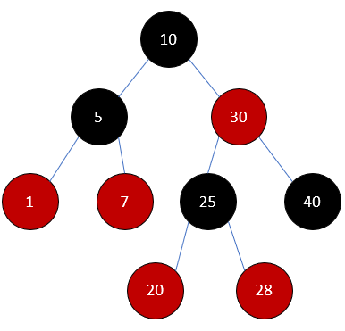

  <a href="https://github.com/Imtjl/fp-red-black-tree-dict-lab2">
    <picture>
      
    </picture>
<h1 align="center">
  Лабораторная работа №2 
  (Словарь на Красно-Чёрном дереве)
</h1>

  </a>

  
 

  

  

   
<b>Table of Contents</b>

- [Title](#title)
- [Conclusion](#end)

---

- Студент: `Дворкин Борис Александрович`
- Группа: `P3331`
- ИСУ: `368090`
- Функциональный язык программирования: `Elixir`

---

## Вывод

### ШОК

- dict/map/bag/set/... - лишь интерфейсы, задают логику работы с данными
- rb-tree/avl-tree/binary-tree/hash-table/linked-list/skip-list/b-tree/heap/fibonacci
  heap/trie/graphs - настоящие структуры данных, задают структуру хранения
  данных

### Regular

В очередной раз, но уже с пониманием заботал полиморфизм - `Ad-hoc` и
`Параметрический`.

Узнал что такое `моноид`, сделал таковой свою структуру, прикольно.

Познакомился с Protocols и поработал со структурами Elixir для создания
обобщённых типов (реализация **параметрического полиморфизма**)

В очередной раз сделал `unit` тесты и `pbt`, прикольно.
